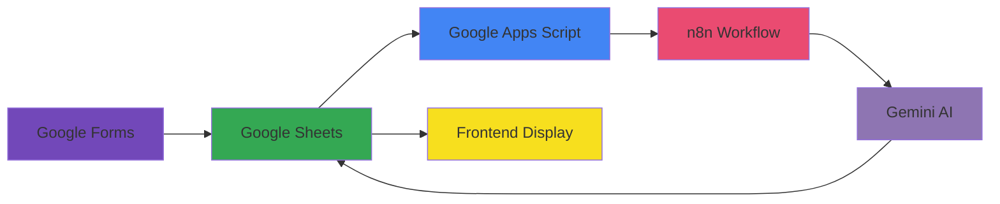

# Candidate Choosing System 🎯

<div align="center">


*A modern, production-ready candidate evaluation and comparison platform developed for Kovan Studio*

[Features](#-key-features) • [Tech Stack](#-tech-stack) • [Quick Start](#-quick-start) • [Documentation](#-project-structure)

</div>

---

## 📋 Overview

The **Candidate Choosing System** is a web-based platform that enables recruiters to evaluate, filter, compare, and manage candidate profiles efficiently. Built as a case study project, it integrates Google Sheets for data management, Gemini AI for candidate evaluation, and n8n for workflow automation.

<div align="center">

**Development Time:** ~12 hours | **Status:** Production-Ready ✅

</div>

---

## ✨ Key Features

<table>
<tr>
<td width="50%">

### 🎯 Core Functionality
- ✅ **Dynamic Candidate Listing** - Real-time data from Google Sheets
- 🔍 **Advanced Filtering & Sorting** - Smart search and filters
- 📊 **Multi-Candidate Comparison** - Compare up to 6 candidates
- 👤 **Detailed Profiles** - Modal-based profile views

</td>
<td width="50%">

### 🤖 AI & Automation
- 🧠 **AI-Powered Evaluation** - Gemini AI assessments
- 🎨 **Responsive Design** - Beautiful light/dark themes
- 🔄 **Automated Workflow** - One-click data refresh
- 📱 **PWA Ready** - Mobile-optimized experience

</td>
</tr>
</table>

---

## 🛠 Tech Stack

<div align="center">

### Frontend


### Backend & Services


### AI & Automation


### Tools & Platform


</div>

---

## 🚀 Quick Start

### Prerequisites
```bash
✓ Modern web browser (Chrome, Firefox, Safari, Edge)
✓ Login credentials (provided by Kovan Studio)
```

### 📖 Usage Guide

<details open>
<summary><b>1️⃣ Access the Platform</b></summary>

```
• Navigate to index.html
• Enter credentials: kovan.studio / candidatepanel
```
</details>

<details>
<summary><b>2️⃣ View Candidates</b></summary>

```
• Browse all candidates on the dashboard
• Use filters to narrow down by AI score (High/Medium/Low)
• Sort by name or score
```
</details>

<details>
<summary><b>3️⃣ Compare Candidates</b></summary>

```
• Select up to 6 candidates using checkboxes
• Click "Karşılaştır" button to compare side-by-side
• View detailed metrics and AI recommendations
```
</details>

<details>
<summary><b>4️⃣ View Detailed Profile</b></summary>

```
• Click any candidate card to open full profile modal
• View contact information and AI analysis
• Read strengths, risks, and recommendations
```
</details>

<details>
<summary><b>5️⃣ Refresh Data</b></summary>

```
• Click "Yenile" button to trigger AI evaluation workflow
• System waits ~15 seconds for processing
• New data automatically displayed
```
</details>

---

## 📁 Project Structure

```
Candidate-Choosing-System/
├── 📄 index.html              # Login page
├── 📊 dashboard.html          # Main candidate dashboard
├── 👨‍💻 developer.html          # Project information page
├── ⚙️ script.js               # Core application logic
├── 🎨 style.css               # Styling & themes
├── 📱 manifest.json           # PWA configuration
├── 🖼️ icons/                  # Logo and avatars
│   ├── kovan-logo.svg
│   ├── default-avatar-male.png
│   └── default-avatar-female.png
└── 📖 README.md               # This file
```

---

## 🔧 Configuration

### Google Apps Script URL
Update the `GOOGLE_SCRIPT_URL` in `script.js`:
```javascript
const GOOGLE_SCRIPT_URL = 'https://script.google.com/macros/s/YOUR_SCRIPT_ID/exec';
```

### n8n Webhook URL
Update the `N8N_TRIGGER_URL` in `script.js`:
```javascript
const N8N_TRIGGER_URL = 'https://your-ngrok-url.ngrok-free.app/webhook/your-webhook-id';
```

---

## 📊 Data Flow



---

## 🎨 Features in Detail

### 🔍 Filtering & Sorting
| Filter Type | Description |
|------------|-------------|
| **High Score** | AI Score 70+ |
| **Medium Score** | AI Score 50-69 |
| **Low Score** | AI Score <50 |
| **Sort by Score** | Ascending/Descending |
| **Sort by Name** | Alphabetical A-Z |

### 🤖 AI Evaluation Metrics
- **AI General Score** - Overall candidate rating (0-100)
- **Strengths** - Key strengths identified by AI
- **Risks** - Potential concerns and red flags
- **Recommendation** - AI-generated hiring recommendation
- **Technologies** - Skills and technical experience

### 🌓 Theme Support
- 🌞 Light mode for daytime viewing
- 🌙 Dark mode for comfortable night viewing
- 🔄 Automatic system preference detection
- 💾 Persistent theme preference

---

## 📱 Responsive Design

<div align="center">

📱 **Mobile First** | 💻 **Desktop Optimized** | 🖥️ **Tablet Ready** | 📦 **PWA Support**

</div>

- Fully responsive interface
- Touch-friendly controls
- Optimized for all screen sizes
- Progressive Web App capabilities

---

## 🔒 Security Notes

⚠️ **Important Security Considerations:**

- ✅ Credentials stored in sessionStorage (cleared on logout)
- ✅ No sensitive data cached locally
- ⚠️ Use environment variables for production
- ⚠️ Consider implementing OAuth 2.0 authentication
- ⚠️ Implement rate limiting for API calls

---

## 🚧 Development Process

This project was developed using **Agile methodology** with continuous AI collaboration:

```
Phase 1 (MVP) ──────> Phase 2 (Enhancement) ──────> Optimization
     │                        │                           │
     ├─ Candidate Listing     ├─ Comparison View          ├─ Performance Tuning
     ├─ Basic Filtering       ├─ Modal Profiles           ├─ Code Optimization
     └─ Simple UI             ├─ Theme Support            └─ Best Practices
                              └─ Advanced Filtering
```

---

## 📄 License

This project is licensed under the **MIT License**

```
MIT License - feel free to use, modify, and distribute
```

---

## 👨‍💻 Developer

<div align="center">

**Eren Kaynak**
*Full Stack Developer*

[](https://github.com/erenkaynak)
[](https://www.linkedin.com/in/eren-kaynak-92355533b/)

</div>

---

## 🤝 Contributing

While this is a case study project, contributions are welcome!

1. 🍴 Fork the repository
2. 🌿 Create your feature branch (`git checkout -b feature/AmazingFeature`)
3. 💾 Commit your changes (`git commit -m 'Add some AmazingFeature'`)
4. 📤 Push to the branch (`git push origin feature/AmazingFeature`)
5. 🎉 Open a Pull Request

---

## 📞 Support

<div align="center">

**Need Help?**

📧 Contact Kovan Studio | 👨‍💻 Reach out to the developer

</div>

---

<div align="center">

**⭐ If you found this project helpful, please consider giving it a star!**

*Built with ❤️ by Eren Kaynak for Kovan Studio*

**Note:** This is a production-ready prototype developed for Kovan Studio's internship candidate evaluation process. All features have been tested and optimized for performance.

</div>
